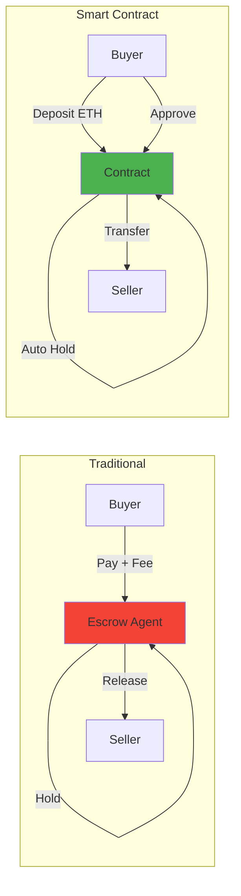
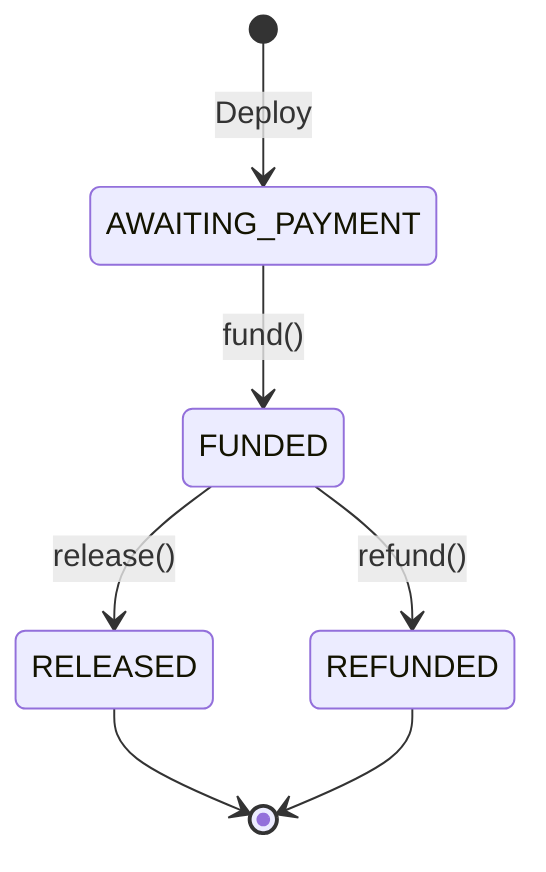
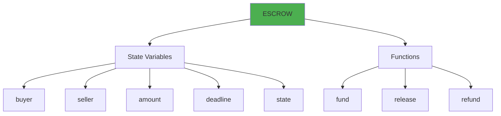
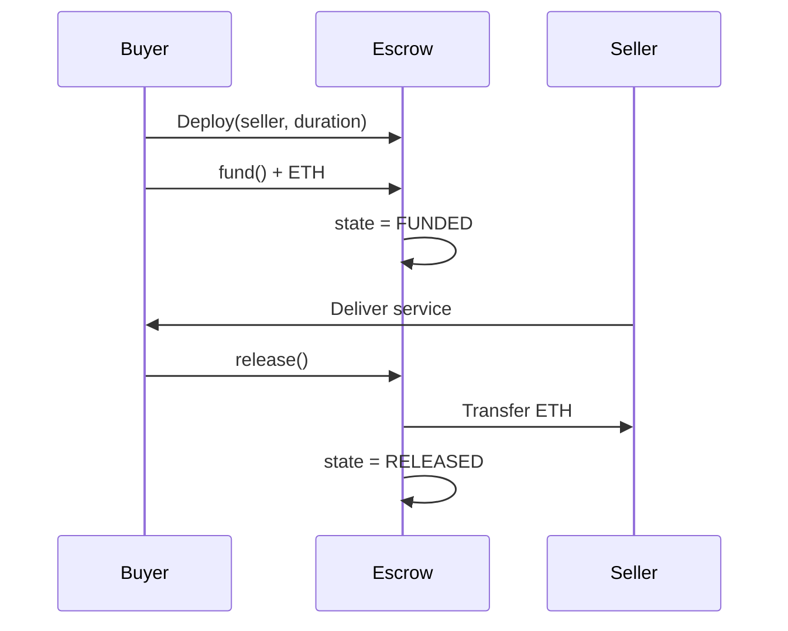

# Escrow Smart Contract

<div align="center">
  <a href="https://docs.soliditylang.org/en/v0.8.20/"></a>
  <a href="https://hardhat.org/"></a>
  <a href="https://opensource.org/licenses/MIT"></a>
  <a href="https://hardhat.org/hardhat-network/docs"></a>
  <a href="https://en.wikipedia.org/wiki/Escrow"></a>
  <a href="https://ethereum.org/"></a>
</div>

<div align="center">
  <h3>A trustless escrow system for secure peer-to-peer transactions</h3>
  <p>Eliminates the need for intermediaries while ensuring transaction safety</p>
  
  <br>
  
  <a href="#overview">Overview</a> •
  <a href="#features">Features</a> •
  <a href="#getting-started">Getting Started</a> •
  <a href="#deployment">Deployment</a> •
  <a href="#usage-examples">Usage</a> •
  <a href="#state-machine">State Machine</a> •
  <a href="#author">Author</a>
  
  <br><br>
  
  
  
  
</div>

---

## Table of Contents

- [Overview](#overview)
- [Features](#features)
- [How Escrow Works](#how-escrow-works)
- [State Machine](#state-machine)
- [Architecture](#architecture)
- [Workflow](#workflow)
- [Getting Started](#getting-started)
- [Contract Details](#contract-details)
- [Deployment](#deployment)
- [Usage Examples](#usage-examples)
- [Security Analysis](#security-analysis)
- [Use Cases](#use-cases)
- [Author](#author)

---

## Overview

The Escrow Smart Contract provides a decentralized, trustless solution for conducting secure transactions between two parties. This contract acts as a neutral third party, holding funds until predetermined conditions are met.

### Key Highlights

- **Trustless Transactions**: No intermediary required
- **State-Based Logic**: Four clear states with controlled transitions
- **Time-Locked Refunds**: Automatic refund after deadline
- **Buyer Protection**: Buyer controls fund release and refunds
- **Zero Fees**: No middleman fees, only gas costs
- **Transparent**: All actions on-chain

---

## Features

| Feature | Description |
|---------|-------------|
| **State Management** | Four states ensure proper transaction flow |
| **Fund Locking** | Securely holds ETH until conditions met |
| **Buyer Control** | Buyer initiates all key actions |
| **Deadline Protection** | Time-based refund mechanism |
| **Immutable Parties** | Buyer and seller set at deployment |

---

## How Escrow Works

### Traditional vs Smart Contract Escrow

<div align="center">



</div>

---

## State Machine

<div align="center">



</div>

| State | Description | Actions Allowed |
|-------|-------------|-----------------|
| **AWAITING_PAYMENT** | Waiting for deposit | `fund()` |
| **FUNDED** | ETH locked | `release()`, `refund()` |
| **RELEASED** | Paid to seller | None |
| **REFUNDED** | Returned to buyer | None |

---

## Architecture

<div align="center">



</div>

---

## Workflow

### Complete Transaction Flow

<div align="center">



</div>

---

## Getting Started

### Prerequisites

- Node.js v16+
- npm or yarn
- Git
- Hardhat

### Installation

```bash
# Clone repository
git clone https://github.com/Siddheshwar-cloud/escrow-contract.git
cd escrow-contract

# Install dependencies
npm install
```

### Project Structure

```
escrow-contract/
├── contracts/
│   └── ESCROW.sol
├── scripts/
│   └── deploy.js
├── hardhat.config.js
└── README.md
```

---

## Contract Details

### State Variables

```solidity
address public buyer;
address public seller;
uint256 public amount;
uint256 public deadline;
State public state;
```

### Constructor

```solidity
constructor(address _seller, uint256 _duration)
```

Sets buyer (deployer), seller, and deadline.

### Functions

#### fund()
```solidity
function fund() external payable onlybuyer inState(State.AWAITING_PAYMENT)
```
Buyer deposits ETH into escrow.

#### release()
```solidity
function release() external onlybuyer inState(State.FUNDED)
```
Buyer releases payment to seller.

#### refund()
```solidity
function refund() external onlybuyer inState(State.FUNDED)
```
Buyer reclaims funds after deadline.

---

## Deployment

### Local Network

```bash
# Terminal 1: Start node
npx hardhat node

# Terminal 2: Deploy
npx hardhat run scripts/deploy.js --network localhost
```

### Configuration

Modify in `deploy.js`:
```javascript
const duration = 60 * 60;  // 1 hour
const seller = "0xYourSellerAddress";
```

---

## Usage Examples

### Complete Transaction

```javascript
const { ethers } = require("hardhat");

async function main() {
  const [buyer, seller] = await ethers.getSigners();
  
  // Deploy
  const Escrow = await ethers.getContractFactory("ESCROW");
  const escrow = await Escrow.deploy(seller.address, 3600);
  await escrow.waitForDeployment();
  
  // Fund
  await escrow.fund({ value: ethers.parseEther("1.0") });
  console.log("Funded 1 ETH");
  
  // Release
  await escrow.release();
  console.log("Released to seller");
}

main();
```

### Refund Scenario

```javascript
async function refundExample() {
  const [buyer, seller] = await ethers.getSigners();
  
  // Deploy with 10 second deadline
  const Escrow = await ethers.getContractFactory("ESCROW");
  const escrow = await Escrow.deploy(seller.address, 10);
  await escrow.waitForDeployment();
  
  // Fund
  await escrow.fund({ value: ethers.parseEther("0.5") });
  
  // Wait for deadline
  await new Promise(r => setTimeout(r, 11000));
  
  // Refund
  await escrow.refund();
  console.log("Refunded to buyer");
}
```

### Check Status

```javascript
async function checkStatus(escrowAddress) {
  const escrow = await ethers.getContractAt("ESCROW", escrowAddress);
  
  const buyer = await escrow.buyer();
  const seller = await escrow.seller();
  const amount = await escrow.amount();
  const deadline = await escrow.deadline();
  const state = await escrow.state();
  
  console.log("Buyer:", buyer);
  console.log("Seller:", seller);
  console.log("Amount:", ethers.formatEther(amount), "ETH");
  console.log("Deadline:", new Date(Number(deadline) * 1000));
  console.log("State:", ["AWAITING", "FUNDED", "RELEASED", "REFUNDED"][state]);
}
```

---

## Security Analysis

### Access Control

| Function | Access | Protection |
|----------|--------|------------|
| `fund()` | Buyer Only | `onlybuyer` modifier |
| `release()` | Buyer Only | `onlybuyer` modifier |
| `refund()` | Buyer Only | `onlybuyer` + deadline check |

### Security Features

1. **State Machine**: Prevents invalid transitions
2. **Buyer Control**: Only buyer can execute critical functions
3. **Time Protection**: Refund only after deadline
4. **CEI Pattern**: State changes before transfers
5. **Solidity 0.8.20**: Built-in overflow protection

### Risk Assessment

| Risk | Level | Mitigation |
|------|-------|------------|
| Reentrancy | LOW | State changes first |
| Access Control | SECURE | Strict modifiers |
| State Manipulation | SECURE | State machine |
| Deadline Bypass | SECURE | Timestamp check |

---

## Use Cases

### 1. Freelance Services
Client pays freelancer via escrow. Payment released upon delivery or refunded if not delivered.

### 2. E-Commerce
Buyer deposits payment. Releases upon receiving product or refunds if not shipped.

### 3. Service Agreements
Milestone-based payments for contractors with deadline protection.

### 4. Rental Deposits
Security deposits held in escrow, returned when lease ends or used for damages.

### 5. Event Tickets
Ticket payments held until event occurs or refunded if cancelled.

---

## Comparison Table

| Aspect | Traditional Escrow | Smart Contract |
|--------|-------------------|----------------|
| Fees | 3-5% | Gas only |
| Speed | Days | Minutes |
| Trust | Required | Trustless |
| Automation | Manual | Automatic |
| Availability | Business hours | 24/7 |
| Global | Limited | Yes |

---

## Technology Stack

| Technology | Version | Purpose |
|------------|---------|---------|
| Solidity | ^0.8.20 | Contract language |
| Hardhat | Latest | Development |
| Ethers.js | v6 | Interactions |
| Node.js | v16+ | Runtime |

---

## Best Practices

### For Buyers
- Set reasonable deadlines
- Verify seller address
- Test with small amounts first
- Document agreements off-chain
- Monitor deadline expiry

### For Sellers
- Confirm escrow funded before delivering
- Deliver before deadline
- Communicate with buyer
- Keep delivery proof
- Request release promptly

---

## Troubleshooting

**"You are Not a buyer"**
- Only deployer can call functions
- Check you're using correct account

**"Invalid state"**
- Ensure contract in correct state
- Check state with `escrow.state()`

**"Too early"**
- Deadline hasn't passed yet
- Check deadline with `escrow.deadline()`

**"Transfer Failed"**
- Recipient cannot receive ETH
- Check recipient has receive/fallback

---

## FAQ

**Q: Can seller withdraw directly?**
A: No, only buyer can release payment.

**Q: What if buyer never releases or refunds?**
A: After deadline, buyer can refund. Before deadline, funds remain locked.

**Q: Can deadline be extended?**
A: No, deadline set at deployment is immutable.

**Q: Can I cancel before funding?**
A: Yes, just don't call `fund()`.

**Q: Are multiple escrows per contract possible?**
A: No, one escrow per deployment. Deploy new contract for each escrow.

---

## Author

<div align="center">
  
  
  
  
</div>

<br>

<div align="center">
  
</div>

<br>

<table align="center">
  <tr>
    <td align="center" width="200">
      
      <br><strong>GitHub</strong>
      <br><a href="https://github.com/Siddheshwar-cloud">@Siddheshwar-cloud</a>
    </td>
    <td align="center" width="200">
      
      <br><strong>LinkedIn</strong>
      <br><a href="https://www.linkedin.com/in/sidheshwar-yengudle-113882241/">Connect</a>
    </td>
    <td align="center" width="200">
      
      <br><strong>Twitter</strong>
      <br><a href="https://x.com/SYangudale">@SYangudale</a>
    </td>
  </tr>
</table>

<div align="center">
  
  <br>
  
  [](https://github.com/Siddheshwar-cloud)
  [](https://www.linkedin.com/in/sidheshwar-yengudle-113882241/)
  [](https://x.com/SYangudale)

</div>

<br>

<div align="center">

### Skills & Expertise


</div>

---

## Show Your Support

<div align="center">
  
[](https://github.com/Siddheshwar-cloud/escrow-contract)

<a href="https://github.com/Siddheshwar-cloud/escrow-contract/stargazers">
  
</a>

**Your star helps others discover secure escrow patterns!**

</div>

### Repository Links

<div align="center">

[](https://github.com/Siddheshwar-cloud/escrow-contract)
[](https://github.com/Siddheshwar-cloud/escrow-contract/fork)
[](https://github.com/Siddheshwar-cloud/escrow-contract/issues)
[](https://github.com/Siddheshwar-cloud/escrow-contract/pulls)

</div>

---

## Contributing

Contributions welcome! Feel free to:

1. Fork the project
2. Create feature branch (`git checkout -b feature/Enhancement`)
3. Commit changes (`git commit -m 'Add enhancement'`)
4. Push to branch (`git push origin feature/Enhancement`)
5. Open Pull Request

---

## License

MIT License - see [LICENSE](LICENSE) file

```
Copyright (c) 2024 Sidheshwar Yengudle
```

---

<div align="center">
  <p>Made with dedication to blockchain security</p>
  <p>Deployed on Local Hardhat Network</p>
  
  <br>
  
  
  
  
  
  <br><br>
  
  **Trustless Escrow, Safer Transactions!**
  
  <br>
  
  <a href="https://github.com/Siddheshwar-cloud/escrow-contract">
    
  </a>
  
  <br><br>
  
  Made with ❤️ and ☕ by Sidheshwar Yengudle © 2024
  
  <br><br>
  
  <a href="https://github.com/Siddheshwar-cloud">
    
  </a>
  
</div>
